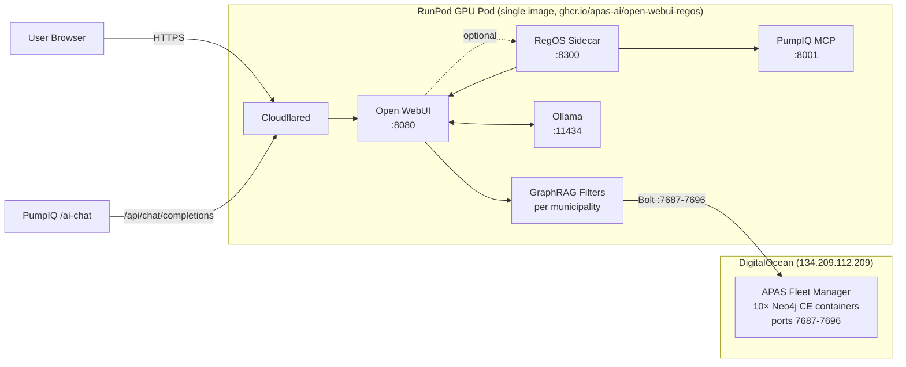

<div align="center">

# RegOS — Regulatory Operating System

**An AI-powered regulatory compliance copilot for water and wastewater utilities.**

[](https://github.com/APAS-ai/open-webui-regos/actions/workflows/apas-prod-build.yaml)
[](https://github.com/APAS-ai/open-webui-regos/commits/regos-anmol-dev)
[](./LICENSE)
[](https://github.com/APAS-ai/open-webui-regos/pkgs/container/open-webui-regos)
[](https://github.com/open-webui/open-webui)
[](https://regos.apas.ai)

[**Live demo →**](https://regos.apas.ai) &nbsp;•&nbsp; [Architecture](#architecture) &nbsp;•&nbsp; [Quick start](#quick-start) &nbsp;•&nbsp; [Available copilots](#available-copilots) &nbsp;•&nbsp; [Configuration](#configuration) &nbsp;•&nbsp; [Operations](#operations--logging)

</div>

---

## What is RegOS?

RegOS turns a chat interface into a **citation-backed regulatory advisor**. Ask a plain-English question about a municipal water/wastewater code — *"What does Coral Gables require for cross-connection control?"* — and get an answer grounded in the actual code text, with section citations, severity scoring, and an audit trail.

It is built on **[Open WebUI](https://github.com/open-webui/open-webui)** (forked) and adds:

- **GraphRAG retrieval** — every municipality has its own Neo4j knowledge graph; relevant chunks are retrieved and injected into the LLM prompt before generation
- **A sidecar API** (`/api/regos`) that orchestrates inlet → LLM → outlet (scoring, citation validation, trace) in one call for programmatic consumers like PumpIQ
- **Per-municipality copilots** — each with its own filter, system prompt, and graph backend
- **Ontology-aware Chapter 24 reasoning** — Miami-Dade DERM Chapter 24 uses a richer graph (entities, classes, threshold evidence hashes) for facility-context disambiguation
- **Tamper-evident audit logging** of every query and response
- **Operations baked for RunPod** — Cloudflare Tunnel, persistent volume layout, log capture, GPU watchdog

> [!NOTE]
> This repository is the **production fork** consumed by [regos.apas.ai](https://regos.apas.ai). The minimal, install-on-stock-Open-WebUI variant lives in [`regos-installer/`](./regos-installer/) and is documented separately.

---

## Architecture



| Layer | Component | Purpose |
|---|---|---|
| **Edge** | Cloudflare Tunnel | TLS termination, custom hostname `regos.apas.ai` |
| **Chat** | Open WebUI (`:8080`) | Frontend, model registry, filter/function host, audit middleware |
| **Retrieval** | GraphRAG filter functions | One per municipality; HyDE embeddings + Neo4j fulltext search; injects cited chunks |
| **Inference** | Ollama (`:11434`) | Local LLM runtime (currently `nemotron-3-nano:30b-a3b-q4_K_M`) |
| **Programmatic API** | RegOS Sidecar (`:8300`) | Single-shot `/regos` endpoint chaining inlet → LLM → outlet for PumpIQ and other backends |
| **Tools** | PumpIQ MCP (`:8001`) | Pump-IQ orchestrator served as MCP tool to copilots |
| **Knowledge** | APAS Fleet Manager | Self-hosted Docker Neo4j CE 5.26.0 cluster on DigitalOcean; one container per municipality graph |

---

## Available Copilots

Each copilot is a custom Open WebUI model bound to one GraphRAG filter that queries one Neo4j fleet instance.

| Model in UI | Filter ID | Fleet Port | Schema |
|---|---|---|---|
| RegOS Chapter 24 Copilot | `graphrag_filter_chapter24` | `7691` | Ontology (`Ch24Document`, `Ch24Entity`, `Ch24Class`) |
| RegOS Chapter 33 Copilot | `graphrag_chapter_33` | `7696` | Common (`Chunk`/`Document`/`Obligation`/`Penalty`) |
| RegOS Miami Copilot | `miami_city_fl` | `7687` | Common |
| RegOS Coral Gables Copilot | `coral_gables_fl` | `7688` | Common |
| RegOS Homestead Copilot | `homestead_fl` | `7689` | Common |
| RegOS Miami Gardens Copilot | `miami_gardens_fl` | `7692` | Common |
| RegOS Pinecrest Copilot | `pinecrest_fl` | `7693` | Common |
| RegOS North Miami Beach Copilot | `north_miami_beach_fl` | `7694` | Common |
| RegOS Opa-Locka Copilot | `graphrag_filter_opalocka` | `7695` | Common |

> [!WARNING]
> `RegOS Miami Beach Copilot` is registered but its source AuraDB graph was empty at migration time, so no fleet instance is provisioned for it. Disable it or provision an instance before enabling for users.

---

## Quick Start

### Production (RunPod)

The image is built automatically on every push to `regos-anmol-dev` and published to `ghcr.io/apas-ai/open-webui-regos:latest`.

```bash
# 1. In the RunPod dashboard, create a pod:
#    - Image: ghcr.io/apas-ai/open-webui-regos:latest
#    - GPU: A6000 40GB (or 2× RTX 4090)
#    - Network volume mounted at /workspace
#    - Container start command: bash /runpod/start.sh
#    - Required env vars: see "Configuration" below

# 2. Once the pod is running, SSH in and verify:
ps aux | grep -E "uvicorn|ollama|cloudflared" | grep -v grep
tail -f /workspace/logs/openwebui.log

# 3. Set DNS — point your hostname (e.g. regos.apas.ai) at the
#    Cloudflare Tunnel UUID via the Cloudflare dashboard.
```

Full RunPod template walkthrough: [`runpod/template.md`](./runpod/template.md).

### Local Development

```bash
git clone https://github.com/APAS-ai/open-webui-regos.git
cd open-webui-regos
git checkout regos-anmol-dev

# Frontend
npm install
npm run dev

# Backend (separate terminal)
cd backend
pip install -r requirements.txt
bash start.sh
# Open WebUI on http://localhost:8080
```

Or with Docker Compose:

```bash
docker compose up --build
```

---

## Configuration

All custom environment variables, prefix-grouped:

### Open WebUI (`OWUI_*`)

| Variable | Required | Default | Description |
|---|---|---|---|
| `OWUI_LOG_FILE_PATH` | no | *(unset → stdout only)* | Path to rotating Loguru file sink. Set by `runpod/start.sh` to `/workspace/logs/openwebui.log` |
| `OWUI_LOG_FILE_ROTATION_SIZE` | no | `50 MB` | Rotation threshold. Bare numbers auto-append " MB" |
| `OWUI_LOG_FILE_RETENTION_COUNT` | no | `5` | Number of rotated archives to keep |
| `LOG_FORMAT` | no | *(text)* | Set to `json` for structured one-line-per-event output |
| `AUDIT_LOG_LEVEL` | no | `NONE` | One of `NONE`, `METADATA`, `REQUEST`, `REQUEST_RESPONSE` |
| `OPENWEBUI_TOKEN` | yes (sidecar) | — | Admin API token used by the sidecar to call back into Open WebUI |

### RegOS Sidecar (`REGOS_*`)

| Variable | Required | Default | Description |
|---|---|---|---|
| `REGOS_MODEL_ID` | yes | `regos-chapter24-copilot` | Default copilot the sidecar dispatches queries to |
| `REGOS_LOG_DIR` | no | *(unset → no file logging)* | Directory for `regos-api.log`. Set by `start.sh` to `/workspace/logs` |
| `REGOS_API_PORT` | no | `8300` | Port the sidecar listens on |

### Cloudflare Tunnel (`CLOUDFLARED_*`)

| Variable | Required | Default | Description |
|---|---|---|---|
| `CLOUDFLARED_TUNNEL_ID` | yes (for tunnel) | — | UUID of the Cloudflare tunnel |
| `CLOUDFLARED_HOSTNAME` | no | `regos.apas.ai` | Primary hostname the tunnel exposes |

Tunnel credentials JSON must exist at `/workspace/cloudflared/<tunnel-id>.json`. See [`docs/CLOUDFLARE_TUNNEL_RUNBOOK.md`](./regos-installer/docs/CLOUDFLARE_TUNNEL_RUNBOOK.md).

### Ollama runtime safety (set by `runpod/start.sh`, overridable via RunPod template)

| Variable | Default | Why it matters |
|---|---|---|
| `OLLAMA_FLASH_ATTENTION` | `true` | Halves attention working memory |
| `OLLAMA_KV_CACHE_TYPE` | `q8_0` | Halves KV cache (fp16 → int8); negligible quality loss |
| `OLLAMA_CONTEXT_LENGTH` | `32768` | Server-level ceiling. Prevents the 256K-context KV crash that detaches the GPU from the container |
| `OLLAMA_NUM_PARALLEL` | `1` | Caps concurrent KV allocations per model |
| `OLLAMA_KEEP_ALIVE` | `-1` | Keep model loaded indefinitely (no cold reload) |
| `OLLAMA_WARMUP_MODEL` | *(empty)* | If set, `start.sh` preloads this model into VRAM after Ollama boot |

### PumpIQ MCP (optional)

| Variable | Required | Description |
|---|---|---|
| `NOAA_CDO_TOKEN` | no | NOAA Climate Data Online API token |
| `SFWMD_API_KEY` | no | South Florida Water Management District API key |

---

## Adding a New Municipality

Brief sketch — the full checklist lives in [`.apas-context/instructions/03-regos-pipeline.md`](./.apas-context/instructions/03-regos-pipeline.md).

1. **Provision the graph** — create a new fleet instance (next-free Bolt port) via the APAS Fleet Manager and load the chunked code into it
2. **Create the filter** — copy `regos-installer/functions/graphrag_filter_chapter24.py` to a new municipality file, update the default `neo4j_uri` Valve to the new fleet port
3. **Register the filter** — add it to `regos-installer/steps/05-register-functions.sh` under the `all` case
4. **Create the copilot** — in Open WebUI Admin → Models, create a new model that wraps the base Ollama model and attaches the filter
5. **Set Valves** in Admin → Functions → your filter → Valves: `neo4j_password`, `neo4j_username`, `neo4j_database`
6. **Test** — at least 3 representative queries; verify citations resolve to real chunks

---

## Operations & Logging

### Log file map

All persisted in `/workspace/logs/` on the pod:

| File | Service | Rotation |
|---|---|---|
| `openwebui.log` | Open WebUI (Loguru sink) | 50 MB, zip, keep 5 |
| `regos-api.log` | RegOS Sidecar (Python `RotatingFileHandler`) | 10 MB, keep 5 |
| `ollama.log` | Ollama daemon | none (shell redirect — rotate manually if it grows) |
| `gpu-watchdog.log` | NVML watchdog | append-only; only writes on GPU loss |
| `pumpiq-mcp.log` | PumpIQ MCP server | none |
| `cloudflared.log` | Cloudflare Tunnel | none |
| `sshd.log` | SSH daemon | none |

Open WebUI's audit log is separate: `/workspace/openwebui/data/audit.log` (10 MB, zip).

### Common tasks (SSH to pod)

```bash
# Tail the two most useful logs
tail -f /workspace/logs/openwebui.log /workspace/logs/regos-api.log

# Check service status
ps aux | grep -E "uvicorn|mcpo|cloudflared|ollama" | grep -v grep

# Health checks
curl -s http://localhost:8080/health
curl -s http://localhost:8300/docs
curl -s http://localhost:11434/api/tags | python3 -m json.tool

# Verify Ollama is actually on GPU
ollama ps     # PROCESSOR column should say 100% GPU; CONTEXT should be 32768

# Has the GPU detached at any point?
cat /workspace/logs/gpu-watchdog.log     # empty = healthy
```

### Recovering from "Failed to initialize NVML: Unknown Error"

This is a known NVIDIA-runc-systemd interaction documented in [`nvidia-container-toolkit#48`](https://github.com/NVIDIA/nvidia-container-toolkit/issues/48). Inside the pod there is no recovery — only a **Stop + Start** of the pod from the RunPod dashboard restores GPU visibility. The defaults baked into `runpod/start.sh` (above) make the trigger condition essentially unreachable; if you still see this, file a ticket with RunPod referencing the upstream issue.

---

## Repository Layout

```
.
├── backend/                    # Open WebUI backend (Python, FastAPI/Uvicorn) — fork of upstream
├── src/                        # Open WebUI frontend (Svelte + TypeScript) — fork of upstream
├── runpod/                     # Custom boot script + Cloudflare config + RunPod template doc
│   ├── start.sh                # First-boot/every-boot orchestration (overrides image CMD)
│   ├── cloudflared-config.yml  # Tunnel config template (placeholders replaced at boot)
│   └── template.md             # RunPod template reference
├── regos-installer/            # Standalone installer for stock Open WebUI (no fork required)
│   ├── api/                    # RegOS Sidecar API (regos_api.py + apas_bridge.py)
│   ├── functions/              # GraphRAG filter sources (canonical copies)
│   ├── prompts/                # Per-copilot system prompts
│   ├── source-patches/         # Surgical patches that inject RegOS into stock Open WebUI source
│   ├── steps/                  # Numbered shell scripts orchestrating install
│   └── docs/                   # Installer-specific runbooks (Cloudflare, Operations, etc.)
├── regos_setup/                # Newer setup scripts + per-municipality filter sources
├── regos-docs/                 # Architecture diagrams, demo scripts, decision records
├── pumpiq-mcp-server/          # PumpIQ MCP (Node.js) — pump system orchestrator served as MCP tool
├── scripts/                    # Operational scripts (graph push, AuraDB migration, batch chunking)
├── docs/                       # Project documentation (build, contributing, security)
├── Dockerfile                  # Production image build (forked from upstream)
└── .github/workflows/          # CI: apas-prod-build.yaml builds and pushes to GHCR
```

---

## Companion Repositories

| Repo | Purpose |
|---|---|
| **APAS-Legal-PDF-Chunking-Dashboard** | Web UI for chunking municipal codes into Neo4j-ready Chunk/Document nodes |
| **APAS-neo4j** | Fleet manager app + Docker infra + AuraDB→Fleet migration scripts |

---

## Troubleshooting

| Symptom | Likely cause | Where to look |
|---|---|---|
| Chat responses are vague, no citations | GraphRAG filter not retrieving — check Neo4j connectivity from filter Valves | Open WebUI Admin → Functions → filter → Valves; `tail /workspace/logs/openwebui.log` |
| Chat fails with `503` or `connection refused` | Sidecar or Ollama down | `ps aux \| grep -E "uvicorn\|ollama"`, then check the relevant log |
| `Failed to initialize NVML: Unknown Error` | GPU detached from container | Pod **Stop + Start** from RunPod dashboard. See operations section above |
| Model spilled to CPU under load | KV cache OOM (rare with current defaults) | `ollama ps` — confirm `PROCESSOR` and `CONTEXT` |
| `regos-api.apas.ai` returns `401` | Sidecar's `OPENWEBUI_TOKEN` missing or stale | RunPod template env; rotate token in Open WebUI admin and update template |

More: [`regos-installer/docs/TROUBLESHOOTING.md`](./regos-installer/docs/TROUBLESHOOTING.md).

---

## Contributing

- **Branch model**: `regos-anmol-dev` is the integration branch; production builds are tagged from there
- **Commit style**: Conventional Commits (`feat:`, `fix:`, `docs:`, `chore:`, `refactor:`)
- **Co-author lines**: do not add machine-generated `Co-Authored-By` lines; APAS commits are authored by humans only
- **Pre-commit**: there is no enforced hook yet; please run `npm run lint` and `python -m pytest backend/` locally before pushing

---

## License

This repository forks [Open WebUI](https://github.com/open-webui/open-webui) and inherits its licensing. See [`LICENSE`](./LICENSE), [`LICENSE_HISTORY`](./LICENSE_HISTORY), and [`LICENSE_NOTICE`](./LICENSE_NOTICE).

RegOS-specific code (everything under `regos-installer/`, `regos_setup/`, `runpod/`, `pumpiq-mcp-server/`, and `scripts/`) is © APAS, Inc.

---

## Acknowledgments

- **[Open WebUI](https://github.com/open-webui/open-webui)** — the upstream project this fork builds on
- **[Ollama](https://ollama.com/)** — local LLM runtime
- **[Neo4j](https://neo4j.com/)** — graph database powering retrieval
- **NVIDIA Nemotron** — base LLM (currently `nemotron-3-nano:30b-a3b-q4_K_M`)
- **Cloudflare Tunnel** — secure exposure without public IP
- **RunPod** — GPU pod hosting

<div align="center">

---

**Built by [APAS](https://apas.ai) — turning regulatory codes into copilots.**

</div>
